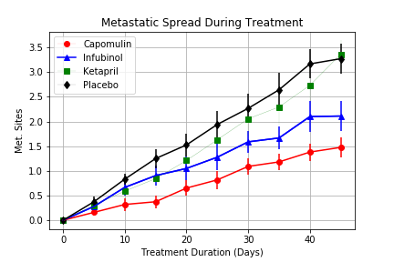

# Matplotlib Challenge - The Power of Plots

Key Tools used: Matplotlib, Python, Pandas, Jupyter Notebook

## Background - Pymaceuticals

While your data companions rushed off to jobs in finance and government, you remained adamant that science was the way for you. Staying true to your mission, you've since joined Pymaceuticals Inc., a burgeoning pharmaceutical company based out of San Diego, CA. Pymaceuticals specializes in drug-based, anti-cancer pharmaceuticals. In their most recent efforts, they've since begun screening for potential treatments to squamous cell carcinoma (SCC), a commonly occurring form of skin cancer.

In this study, 250 mice were treated through a variety of drug regimes over the course of 45 days. Their physiological responses were then monitored over the course of that time. Your objective is to analyze the data to show how four treatments (Capomulin, Infubinol, Ketapril, and Placebo) compare.

## Pymaceuticals

In this challenge, I created three scatter plots. One scatterplot shows how the tumor volume changes over time for each treatment. Another scatterplot that shows how the number of [metastatic](https://en.wikipedia.org/wiki/Metastasis) (cancer spreading) sites changes over time for each treatment. The third scatterplot shows the number of mice still alive through the course of treatment (Survival Rate). Finally, I created a bar graph that compares the total % tumor volume change for each drug across the full 45 days.

